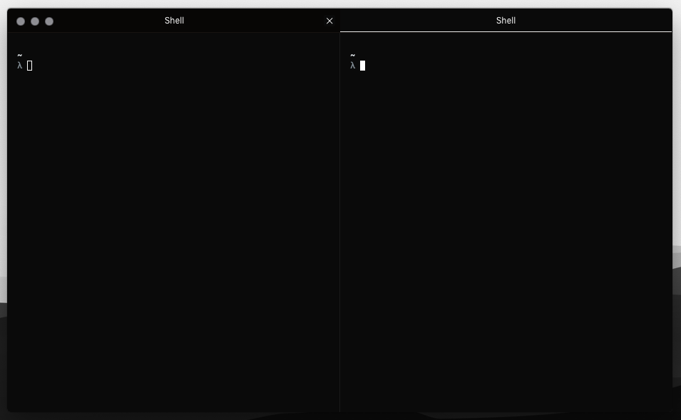

# Xi-Hyper

A minimal monochrome theme for [Hyper](https://hyper.is).



## Installation

### Hyper plugin manager

Ensure you have [Hyper](https://hyper.is) installed. Then run the following from the command line:
```bash
$ hyper install mno-hyper
```

### Manually

Open your `~/.hyper.js` configuration file and add `"mno-hyper"` to your plugins:
```js
module.exports = {

  config: { /*... */ },

  plugins: [
    "mno-hyper"
  ]

};
```

## Complete the look

Styles shown in the screenshot:
```js
fontFamily: 'SF Mono',
padding: '12px 30px 30px 30px'
```

## Related

- [Xi-UI](https://github.com/pacocoursey/Xi-UI): Xi for Atom.
- [Xi-Hyper](https://github.com/pacocoursey/Xi-Hyper): Xi for Hyper.
- [MNO-VSCode](https://marketplace.visualstudio.com/items?itemName=u29dc.mno)

## Acknowledgements

- Heavily inspired by [Apex UI](https://github.com/apex/apex-ui).
